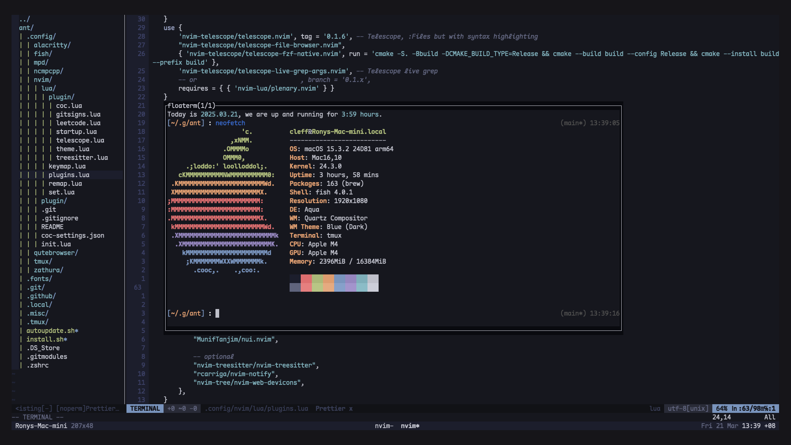
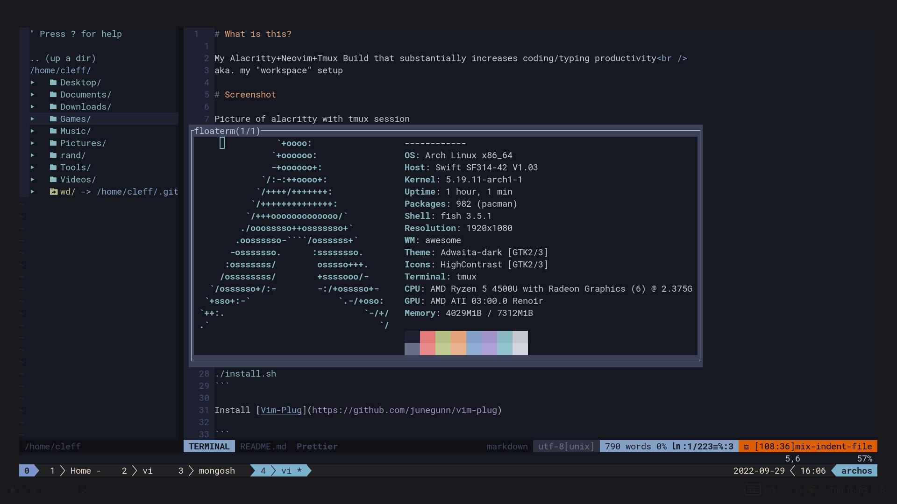
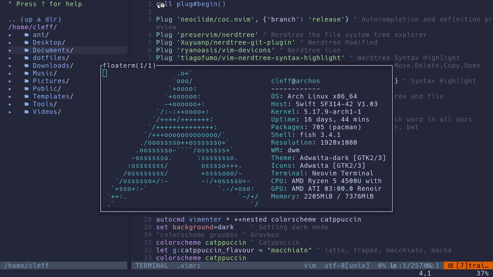
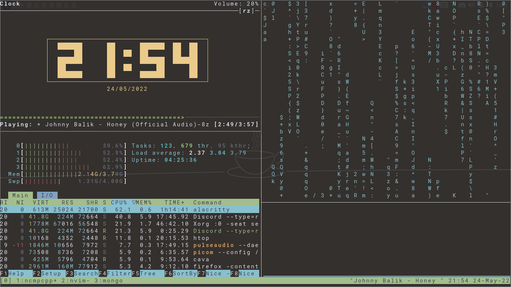

# What is this?

My Alacritty+Neovim+Tmux Build that substantially increases coding/typing productivity<br />
aka. my "workspace" setup

# Screenshot

Picture of nvim with Netrw and Floaterm (Iceberg Theme on MacOS, with Italic support)

Picture of nvim with NERDTree and Floaterm (Iceberg Theme)

Picture of nvim with NERDTree and Floaterm (Catppucin Theme)

Picture of nvim with NERDTree and Floaterm (Gruvbox Theme)

Picture of alacritty with tmux session


# Installation

Install alacritty, neovim, tmux using your favourite package manager<br />
(Arch Linux)

```
sudo pacman -S alacritty neovim tmux
```

Run the Install script

```
git clone --depth 1 https://github.com/ronylee11/ant
git submodule init
git submodule update
cd ant
./install.sh
```

Install [Vim-Plug](https://github.com/junegunn/vim-plug)

```
curl -fLo ~/.vim/autoload/plug.vim --create-dirs \
    https://raw.githubusercontent.com/junegunn/vim-plug/master/plug.vim
```

Install all the plugins in nvim

```
nvim ~/.vimrc
:source %
:PlugInstall
```

Run `:checkhealth` to add other dependencies you need<br />
To Enable Python Support

```
pip install pynvim
sudo pip install pynvim
```

Install [TPM](https://github.com/tmux-plugins/tpm)

```
git clone https://github.com/tmux-plugins/tpm ~/.tmux/plugins/tpm
```

Run `tmux`
Then press CTRL+F, R to source tmux.conf<br/>
CTRL+F, Shift+I to install tmux plugins<br/>

Install other dependencies

```
sudo npm i -g bash-language-server
sudo pacman -S ffmpeg yarn ripgrep
```

Edit snippets with <br/>
:CocCommand snippets.editSnippets<br/>
at the end of the file, add<br/>

```
snippet cl "console.log()" b
console.log($1);
endsnippet
```

Enable Copilot

```
npm i -g n
n install v17
:Copilot setup
```

# Usage

Tmux config from Fatih Arslan

```
    create a tab: ctrl-f c
    close a tab: ctrl-f &
    close a pane: ctrl-f x (this also closes the tab if there is a single pane)
    create vertical pane: ctrl-f v
    create horizontal pane: ctrl-f s
    move between panes: ctrl-f h, ctrl-f j, ctrl-f k and ctrl-f l
    resize panes: ctrl-f H, ctrl-f J, ctrl-f K and ctrl-f L
    jump to specific tab: ctrl-f <number>, i.e: ctrl-f 3
```

Neovim config

```
	Coc.nvim:
		Show definition of current word - Shift + K
	NERDTree:
		Show Hidden Files - Shift + B
		Toggle Tree - Ctrl + B
		Switch to Next Opened File - Ctrl + RightArrow
		Switch to Previous Opened File - Ctrl + LeftArrow
		Toggle Focus to Tree - Ctrl + W + W
		Open File in New Tab - T
		Open File in Horizontal Split - I
		Open File in Vertical Split - S
		Create/(Move or Rename)/Delete File - M + A/M/D
    Refresh/Reload Files - R
	Floaterm:
		Toggle Terminal - Alt + Escape
		Terminal Normal Mode - Escape + Escape
		Terminal Insert Mode - I
	Vim-Tmux Navigator:
		Switch Focus to Left - Ctrl + H
		Switch Focus to Right - Ctrl + L
		Switch Focus to Top - Ctrl + K
		Switch Focus to Bottom - Ctrl + J
	NERDcommenter:
		Comment/Uncomment Line - Ctrl + /
		Comment/Uncomment Multiple Line - (Highlight in Visual Mode) and Ctrl + /
  Telescope:
    Search File by Filename - Ctrl + P
    Search File by Content - Ctrl + N
  Harpoon:
    View all marked files - Ctrl + A
    Mark current file - Alt + A
    Jump to marked file no 1~5 - Alt + 1~5


```

# Plugins

- Coc.nvim - https://github.com/neoclide/coc.nvim
- Nerdtree - https://github.com/preservim/nerdtree
- Nerdtree Git Plugin - https://github.com/Xuyuanp/nerdtree-git-plugin
- Nerdtree Devicons - https://github.com/ryanoasis/vim-devicons
- Nerdtree Syntax Highlight - https://github.com/tiagofumo/vim-nerdtree-syntax-highlight
- Nerdtree Visual Selection - https://github.com/PhilRunninger/nerdtree-visual-selection
- Floaterm - https://github.com/voldikss/vim-floaterm
- Gruvbox Theme - https://github.com/morhetz/gruvbox
- Airline - https://github.com/vim-airline/vim-airline
- Airline Theme - https://github.com/vim-airline/vim-airline-themes#vim-airline-themes
- Yats TS Syntax - https://github.com/HerringtonDarkholme/yats.vim
- Vim-Tmux Navigator - https://github.com/christoomey/vim-tmux-navigator
- Nerdcommenter - https://github.com/preservim/nerdcommenter
- Treesitter - https://github.com/nvim-treesitter/nvim-treesitter

# FAQ

- How to synchronize sudo nvim and nvim ?<br />
  <br/>
  In /etc/xdg/nvim/sysinit.vim, add `source /home/<user>/.config/nvim/init.vim` <br />
  <br />
  Link Treesitter Modules and Coc Settings

  ```
  ln -s /home/<user>/.config/nvim/lua /etc/xdg/nvim/lua
  ln -s /home/<user>/.config/nvim/coc-settings.json /etc/xdg/nvim/coc-settings.json
  ```

  Enable Vim-Plug

  ```
  ln -s /home/<user>/.vimrc /root/.vimrc
  ln -s /home/<user>/.vim/ /root/.vim
  ```

  Link Coc Extensions

  ```
  ln -s /home/<user>/.config/coc /root/.config/coc
  ```

  Link Plugins

  ```
  su
  cd /root/.local/share/nvim/
  ln -s /home/<user>/.local/share/nvim/plugged plugged
  ```

  Link Python Modules (specifically needing pynvim)

  ```
  cd /root/.local
  ln -s /home/<user>/.local/lib lib
  ```

- How to fix coc-rainbow-fart not playing audio ?<br />
  <br />
  In ~/.config/coc/extensions/coc-rainbow-fart-data<br />
  Remove ffplay and replace it with a symlink to ffplay installed locally (/bin/ffplay)<br />
  With the command `ln -s /bin/ffplay ffplay`<br />

# Repositories

- Github - https://github.com/ronylee11/ant
- Gitlab - https://gitlab.com/ronylee11/ant

# Useful Resources

- Vim Tutorial - https://www.youtube.com/watch?v=H3o4l4GVLW0&list=PLm323Lc7iSW_wuxqmKx_xxNtJC_hJbQ7R
- How to add Vim Plugins - https://www.linuxfordevices.com/tutorials/linux/vim-plug-install-plugins
- Lazygit - https://github.com/jesseduffield/lazygit
- Ben Awad's Vim configure tutorial - https://www.youtube.com/watch?v=gnupOrSEikQ
- benbrastmckie's ANT build - https://www.youtube.com/watch?v=Xvu1IKEpO0M&t=226s
- Fatih Arslan's article about Integrating Alacritty with Tmux - https://arslan.io/2018/02/05/gpu-accelerated-terminal-alacritty/
- ANT True Color issue - https://gist.github.com/andersevenrud/015e61af2fd264371032763d4ed965b6
- NERDTree Keybind - https://vi.stackexchange.com/questions/9967/how-do-i-open-and-close-nerdtree-toggle-nerdtree-view-using-a-single-keystroke
- Floaterm Keybind - https://github.com/vim/vim/issues/2216
- Bind Ctrl+/ - https://stackoverflow.com/questions/9051837/how-to-map-c-to-toggle-comments-in-vim
- How to search for a specific word in all files - https://stackoverflow.com/questions/38398787/how-do-i-search-in-all-files-of-my-project-using-vim
- How to set specific tab space - https://stackoverflow.com/questions/1878974/redefine-tab-as-4-spaces
- How to tab forward and backward in vim - https://stackoverflow.com/questions/4559896/how-to-tab-backwards-remove-a-tab-or-tab-spaces-in-vim
- Zathura config - https://gist.github.com/michaelmrose/9595075b43f24aa903fa
- How to reload file - https://vi.stackexchange.com/questions/444/how-do-i-reload-the-current-file
