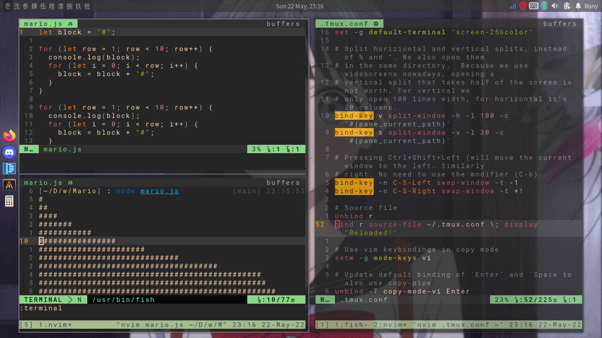

# What is this?

My Alacritty+Neovim+Tmux Build that substantially increases coding/typing productivity<br />
aka. my "workspace" setup

# Screenshot

Picture of 3 alacritty nvim instances, one running terminal using tmux


# Usage

Tmux config from Fatih Arslan
```
    create a tab: ctrl-f c
    close a tab: ctrl-f &
    close a pane: ctrl-f x (this also closes the tab if there is a single pane)
    create vertical pane: ctrl-f v
    create horizontal pane: ctrl-f s
    move between panes: ctrl-f h, ctrl-f j, ctrl-f k and ctrl-f l
    resize panes: ctrl-f H, ctrl-f J, ctrl-f K and ctrl-f L
    jump to specific tab: ctrl-f <number>, i.e: ctrl-f 3
```

# Repositories

- Github - https://github.com/ronylee11/ant
- Gitlab - https://gitlab.com/ronylee11/ant

# Useful Resources
- Vim Tutorial - https://www.youtube.com/watch?v=H3o4l4GVLW0&list=PLm323Lc7iSW_wuxqmKx_xxNtJC_hJbQ7R
- How to add Vim Plugins - https://www.linuxfordevices.com/tutorials/linux/vim-plug-install-plugins
- Lazygit - https://github.com/jesseduffield/lazygit
- Ben Awad's Vim configure tutorial - https://www.youtube.com/watch?v=gnupOrSEikQ
- benbrastmckie's ANT build - https://www.youtube.com/watch?v=Xvu1IKEpO0M&t=226s
- Fatih Arslan's article about Integrating Alacritty with Tmux - https://arslan.io/2018/02/05/gpu-accelerated-terminal-alacritty/
